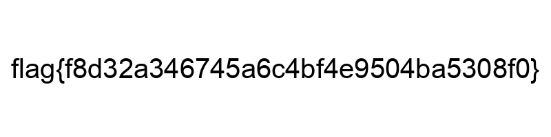

# Challenge 

They say you aren't supposed to judge a book by its cover, but this is one of my favorites!

# Solution

- file is a png image not rar file :) 

```bash
└─$ file book.rar 
book.rar: PNG image data, 800 x 200, 8-bit/color RGB, non-interlaced

└─$ mv book.rar book.png

```

## flag
